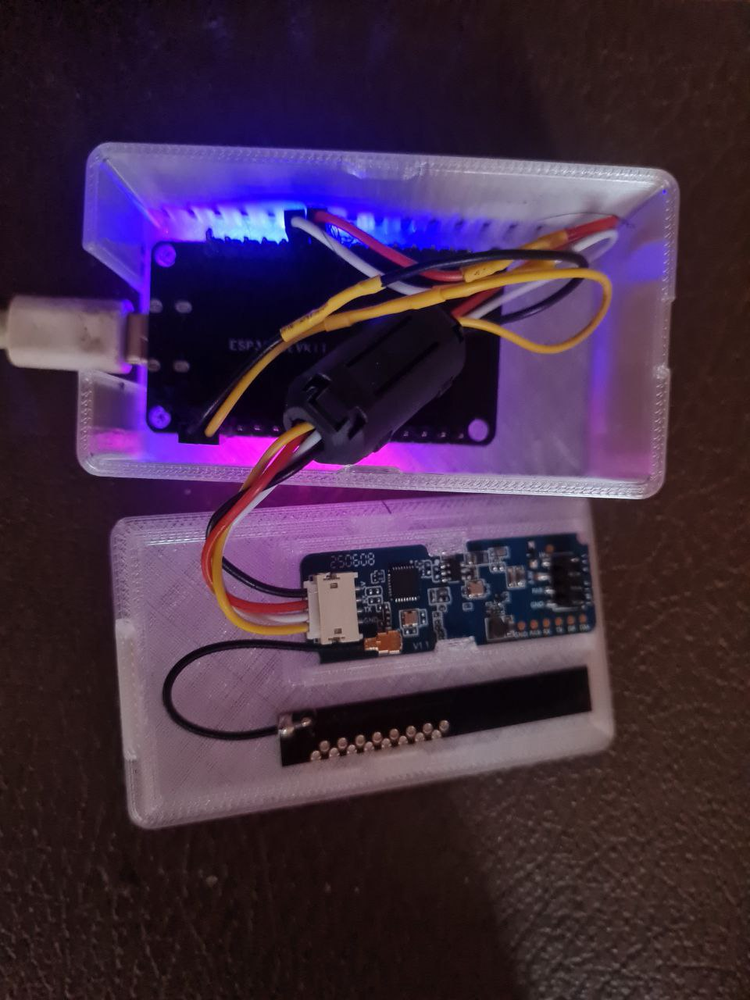
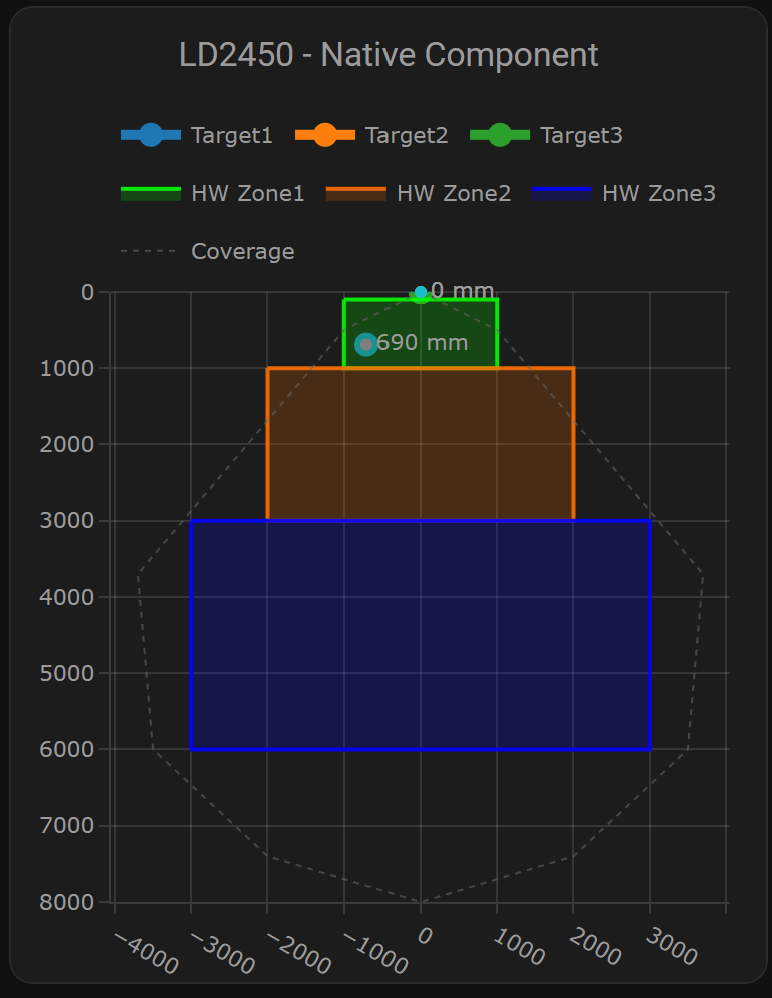

# 📡 ESPHome + Home Assistant для радара HLK-LD2450

> **Минималистичная рабочая версия** - содержит только проверенные и действительно работающие компоненты для радара LD2450 с интеграцией в Home Assistant и поддержкой USB-UART настройки

[](https://esphome.io)
[](https://www.home-assistant.io)
[](LICENSE)

---

## 🎯 О проекте

Этот репозиторий содержит **готовые к использованию конфигурации** для миллиметрового волнового радара **HLK-LD2450** с интеграцией в Home Assistant через ESPHome.

> **💡 Принцип проекта:** В репозитории оставлены только те компоненты, которые действительно работают и приносят пользу. Все лишнее удалено.

### ✅ Что включено

- ✅ **ESPHome конфигурации** (ESP-IDF Framework)
- ✅ **Нативный компонент LD2450** для ESPHome
- ✅ **Карточки Plotly** для визуализации в Home Assistant
- ✅ **USB-UART инструменты** для предварительной настройки радара
- ✅ **Полная документация** и примеры

---

## 📦 Структура репозитория

```
CARE/
├── ESPHome/                          # ESPHome конфигурации (ESP-IDF Framework)
│   ├── LD2450_with_native_component.yaml  # ⭐ Рабочая конфигурация ESPHome
│   ├── Plotly_Graph_Native_Component.txt  # Карточка для HA
│   ├── README.md                     # Документация
│   └── secrets.yaml.example          # Шаблон секретов
├── scripts/                          # Скрипты для работы с радаром
│   ├── radar.py                     # Python монитор радара
│   ├── connect_radar.sh             # Подключение в WSL
│   └── README.md                     # Документация скриптов
├── GUIDE_ESPHome_HASSio_UART.md     # 📚 Полное руководство
├── README.md                         # Этот файл
└── LICENSE                           # Лицензия
```

---

## 🖼️ Галерея

### Устройство



### Карточка для Home Assistant (ha_radar)



---

## 🚀 Быстрый старт

### 1. Клонирование репозитория

```bash
git clone <your-repo-url>
cd CARE
```

### 2. Настройка секретов

```bash
cd ESPHome/
cp secrets.yaml.example secrets.yaml
nano secrets.yaml
```

Заполните:
```yaml
wifi_ssid: "YOUR_WIFI_SSID"
wifi_password: "YOUR_WIFI_PASSWORD"
ota_password: "YOUR_OTA_PASSWORD"
hotspot_password: "YOUR_HOTSPOT_PASSWORD"
api_encryption_key: "YOUR_API_ENCRYPTION_KEY"  # См. ниже
```

**Генерация API ключа:**
```bash
esphome encryption-key
```

### 3. Компиляция и прошивка

```bash
cd ESPHome/
esphome compile LD2450_with_native_component.yaml
esphome upload LD2450_with_native_component.yaml
```

### 4. Добавление в Home Assistant

1. Откройте **Settings → Devices & Services**
2. Найдите **"ld2450"** в обнаруженных устройствах
3. Нажмите **"Configure"**
4. Введите ваш `api_encryption_key` из `secrets.yaml`
5. Готово! 🎉

### 5. Добавление карточки Plotly

1. Установите **Plotly Graph Card** через HACS
2. Откройте Dashboard → **Edit** → **Add Card** → **Manual**
3. Скопируйте содержимое `Plotly_Graph_Native_Component.txt`
4. Вставьте в редактор
5. Сохраните

---

## 📚 Документация

### 📖 Полное руководство

**Читайте детальное руководство:** [`GUIDE_ESPHome_HASSio_UART.md`](GUIDE_ESPHome_HASSio_UART.md)

Оно включает:
- ✅ Детальное описание ESPHome конфигураций
- ✅ Инструкции по установке карточек Home Assistant
- ✅ Настройку радара через USB-UART
- ✅ Примеры и troubleshooting

### 🔗 Дополнительные ресурсы

- **ESPHome документация:** https://esphome.io/components/sensor/ld2450.html
- **Оригинальный проект:** https://github.com/53l3cu5/ESP32_LD2450
- **Plotly Graph Card:** https://github.com/dbuezas/lovelace-plotly-graph-card
- **Конфигуратор зон:** https://53l3cu5.github.io

---

## 🔧 Аппаратная часть

### Подключение радара к ESP32

```
LD2450                    ESP32
─────────────────         ───────────────────
VCC (5V)  ────────────►   5V (стабилизированное)
GND       ────────────►   GND
TX        ────────────►   GPIO16 (RX2)
RX        ────────────►   GPIO17 (TX2)
```

**⚠️ Важно:**
- Радар требует **5V 500mA минимум**
- UART работает на **3.3V логике**, но питание 5V
- Используйте качественный USB кабель или внешний БП

### Технические характеристики LD2450

| Параметр | Значение |
|----------|----------|
| **Частота** | 24 GHz |
| **Дальность** | 0.5 - 8 метров |
| **Угол обзора** | ±60° горизонтально, ±45° вертикально |
| **Цели** | До 3 одновременно |
| **Интерфейс** | UART (256000 baud) |
| **Питание** | 5V DC, 200-500 mA |

---

## 🎯 Возможности

### ✅ ESPHome

- **3 аппаратные зоны** радара (на уровне LD2450)
- **3 цели одновременно** с координатами X, Y, Speed, Angle
- **Автоматическое включение** режима множественных целей
- **Веб-интерфейс** для настройки
- **OTA обновления** по WiFi
- **LED индикация** по зонам

### ✅ Home Assistant

- **Plotly визуализация** в реальном времени
- **Настройка зон** через GUI
- **Автоматизации** на основе присутствия
- **История** координат целей
- **Дашборды** с карточками

### ✅ USB-UART настройка

- **Python скрипт** для мониторинга (`scripts/radar.py`)
- **Подключение в WSL** (`scripts/connect_radar.sh`)

---

## 🛠️ Утилиты и скрипты

### Чтение данных радара

**Python:**
```bash
python3 scripts/radar.py
```

### Подключение в WSL

```bash
./scripts/connect_radar.sh
```

### Настройка через официальный инструмент HLK

Используйте официальный инструмент `HLK-LD2450_TOOL_English.exe` для настройки параметров радара.

---

## 📋 Требования

### Программное обеспечение

- **ESPHome** 2023.12.0 или новее
- **Home Assistant** 2023.12.0 или новее (опционально)
- **Python 3** с библиотекой `pyserial` (для скриптов)

### Аппаратура

- **ESP32** (любая модель с WiFi)
- **HLK-LD2450** радар
- **USB-UART переходник** (CH340, CP2102, FT232) - опционально

---

## ⚡ Почему ESP-IDF?

**Преимущества ESP-IDF:**
- ✅ Стабильнее UART на 256000 baud
- ✅ Меньше размер прошивки (-17%)
- ✅ Лучшая производительность (+10-15%)
- ✅ Меньше потребление RAM (-13%)
- ✅ Будущее ESPHome (переход на ESP-IDF по умолчанию)

**Путь:** `ESPHome/LD2450_with_native_component.yaml`

---

## 🤝 Вклад в проект

Мы приветствуем вклад в проект! Пожалуйста:

1. Fork репозитория
2. Создайте ветку для новой функции (`git checkout -b feature/AmazingFeature`)
3. Закоммитьте изменения (`git commit -m 'Add some AmazingFeature'`)
4. Push в ветку (`git push origin feature/AmazingFeature`)
5. Откройте Pull Request

---

## 📄 Лицензия

Этот проект распространяется под лицензией MIT. См. файл [`LICENSE`](LICENSE) для деталей.

---

## 🙏 Благодарности

- **53l3cu5** - за оригинальный проект [ESP32_LD2450](https://github.com/53l3cu5/ESP32_LD2450)
- **dbuezas** - за [Plotly Graph Card](https://github.com/dbuezas/lovelace-plotly-graph-card)
- **Hi-Link Electronics** - за отличный датчик LD2450

---

## 📞 Поддержка

- 📖 **Документация:** [`GUIDE_ESPHome_HASSio_UART.md`](GUIDE_ESPHome_HASSio_UART.md)
- 🐛 **Issues:** Откройте issue в репозитории
- 💬 **Обсуждения:** Используйте Discussions для вопросов

---

**Версия:** 1.0  
**Дата:** Октябрь 2025  
**Статус:** ✅ Production Ready - Минималистичная рабочая версия

💡 **Совет:** Начните с ESP-IDF версии с нативным компонентом - это самый простой и производительный вариант!

✨ **Философия проекта:** Только проверенные, работающие компоненты. Ничего лишнего.
