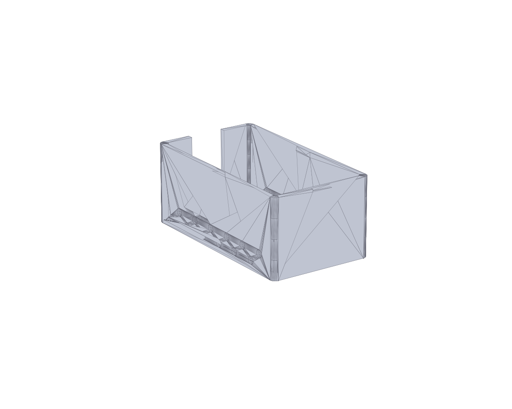
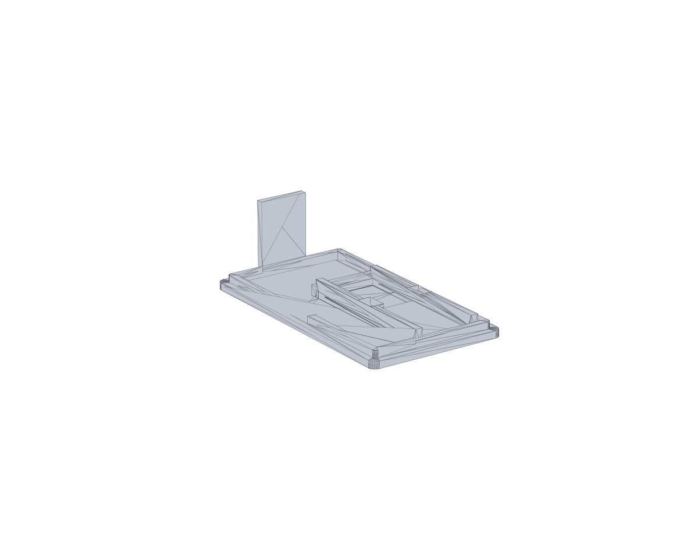

# Корпус (STL) — превью, размеры и параметры печати

Набор моделей корпуса и крышек. Для наглядности рядом с каждым `.stl` лежит PNG‑превью.

## Файлы

- `Box.stl` — исправленная манифолдная модель коробки.  
  
- `Lid.stl` — крышка (вариант 1).  
  
- `Lid(2).stl` — крышка (вариант 2, аналогична `Lid.stl`).  
  [.png)](Lid(2).stl)
- `Lid(1).stl` — уменьшенная крышка.  
  [.png)](Lid(1).stl)

## Габариты и характеристики (мм, мм², мм³)

- Box.stl: 71.60 × 40.20 × 30.00; S≈17888.59; V≈16829.31; watertight: да
- Lid.stl: 71.60 × 40.20 × 22.00; S≈9228.46; V≈6185.75; watertight: да
- Lid(2).stl: 71.60 × 40.20 × 22.00; S≈9228.46; V≈6185.75; watertight: да
- Lid(1).stl: 49.53 × 23.12 × 6.01; S≈3958.95; V≈2642.56; watertight: да

Примечание: единицы предполагаются в миллиметрах.

## Рекомендации по печати (FDM)

- Материал: PLA или PETG (для большей термостойкости — PETG).
- Высота слоя: 0.2 мм (качество) или 0.28 мм (быстрая печать).
- Стенки (Perimeters): 3–4 линии (толщина ~1.2–1.6 мм соплом 0.4).
- Заполнение (Infill): 20–30% для `Box`, 15–20% для крышек.
- Верх/низ: 5–7 верхних и 4–6 нижних слоёв при слое 0.2 мм.
- Скорость: 50–70 мм/с (ориентируйтесь на ваш принтер).
- Адгезия: при необходимости `brim` 3–5 мм для `Box`.

## Использование исправленной коробки

Для печати используйте `Box.stl` — модель проверена как манифолдная.

