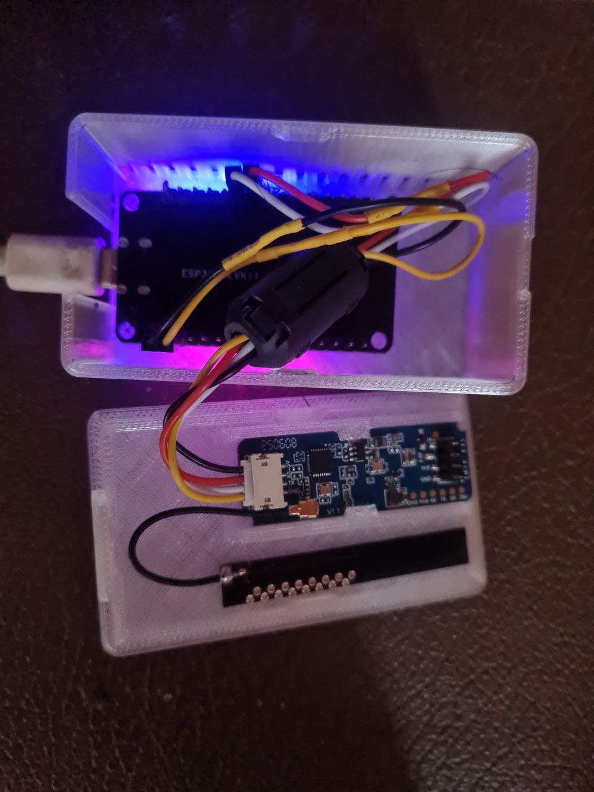
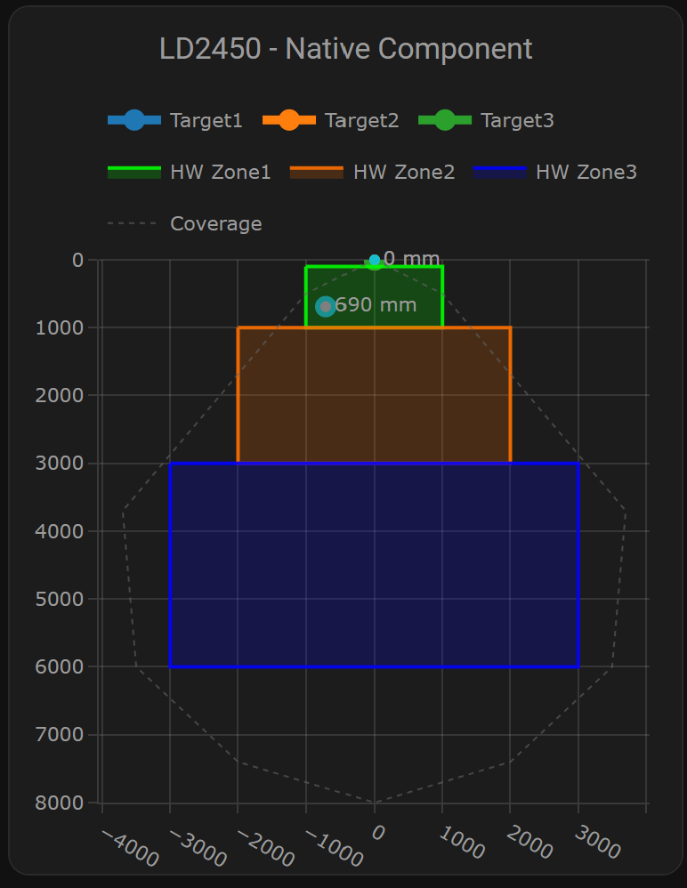

# HLK-LD2450: выжали из датчика всё. Регистры, зоны, нативный компонент

**Хаб:** Железо (или Устройства)

**Ключевые слова:** HLK-LD2450, ESPHome, Home Assistant, ESP32, миллиметровый радар, mmWave, датчик присутствия, IoT, умный дом, бинарный протокол, Plotly

---

> При публикации на Хабре:
> - Заставка: habr_cover.jpg (780×440, <1 МБ)
> - В тексте: device_photos/photo.jpg (устройство), device_photos/ha_radar.png (карточка HA)

Миллиметровый радар HLK-LD2450 — недорогой датчик присутствия с координатами целей. Чаще всего его используют как «есть/нет движения», но по протоколу он отдаёт X, Y, скорость, угол для трёх целей одновременно. Мы разобрали бинарный протокол, настроили аппаратные зоны, управляем регистрами через ESPHome и Home Assistant, и всё это — без промежуточных прослоек.

## Что за датчик

LD2450 — 24 ГГц, дальность 0.5–8 м, угол обзора ±60° по горизонтали. UART 256000 baud, бинарный протокол (не AT-команды). Внутри — три аппаратные зоны, которые можно задать прямоугольниками в миллиметрах. Радар отдаёт только цели внутри этих зон, фильтрация делается на чипе.



## Проблема «из коробки»

Стандартные решения часто ограничиваются чтением потока данных. Зоны либо не трогают, либо задают один раз через официальный HLK-LD2450_TOOL. Чувствительность, порог энергии, режим работы (Normal, High Sensitivity, Low Power, High Precision) — всё это сидит в регистрах, но доступа к ним из домашней автоматизации обычно нет.

Мы хотели:
- менять зоны из Home Assistant;
- настраивать чувствительность, порог энергии, время удержания цели, фильтр скорости;
- переключать режим работы и частоту обновления;
- записывать конфигурацию в радар и перезагружать его;
- видеть три цели с координатами в реальном времени.

## Нативный компонент и ESP-IDF

ESPHome имеет компонент `ld2450`, который работает напрямую с UART. Никаких промежуточных протоколов — только бинарные команды к радару.

Важный момент: UART на 256000 baud на Arduino-фреймворке ведёт себя нестабильно. Мы перешли на ESP-IDF: прошивка меньше примерно на 17%, RAM тоже, UART держится стабильно. ESPHome постепенно переводит проекты на ESP-IDF по умолчанию, так что это ещё и задел на будущее.

## Бинарный протокол

Команды к радару идут в формате:

```
Header: FD FC FB FA
Length: 2 байта (little-endian)
Command: 2 байта
Data: N байт
Footer: 04 03 02 01
```

Примеры команд, которые мы отправляем из ESPHome:

**Чувствительность (0x64)** — 8 значений по диапазонам дальности:
```cpp
uint8_t cmd_sensitivity[] = {
  0xFD, 0xFC, 0xFB, 0xFA,
  0x0A, 0x00,
  0x64, 0x00,
  sens, sens, sens, sens, sens, sens, sens, sens,
  0x04, 0x03, 0x02, 0x01
};
```

**Порог энергии (0x60)** — фильтр слабых отражений:
```cpp
uint8_t cmd_energy[] = {
  0xFD, 0xFC, 0xFB, 0xFA,
  0x04, 0x00,
  0x60, 0x00,
  (uint8_t)(energy & 0xFF),
  (uint8_t)((energy >> 8) & 0xFF),
  0x04, 0x03, 0x02, 0x01
};
```

**Время удержания цели (0x61)**, **фильтр скорости (0x62)**, **режим работы (0x65)**, **частота обновления (0x66)** — по тому же принципу. Сохранение в EEPROM радара — команда 0x60 0x61.

Все эти вызовы собраны в кнопку «Записать конфигурацию в радар» в Home Assistant. Меняешь слайдеры — жмёшь кнопку — настройки пишутся в радар и сохраняются при отключении питания.

## Аппаратные зоны

У LD2450 три зоны. Каждая — прямоугольник (X1, Y1, X2, Y2) в миллиметрах и таймаут присутствия. Радар сам отсекает цели вне зон.

Мы задаём каскад по глубине:
- Зона 1: 2 м × 0.75 м (глубина 250–1000 мм) — близко;
- Зона 2: 4 м × 2 м (1000–3000 мм) — средне;
- Зона 3: 6 м × 3 м (3000–6000 мм) — далеко.

Координаты зон настраиваются в HA как `number`-сущности. Кнопка «Применить зоны по умолчанию» выставляет эти значения, «Применить и перезагрузить радар» — отправляет их в датчик и перезапускает его.

## Три цели и Multi-Target

По умолчанию радар может отдавать одну цель. Режим Multi-Target включается отдельной командой. Мы включаем его при первом запуске и держим включённым. Ограничение: в Multi-Target частота обновления не больше 10 Гц, throttle сенсоров — минимум 100 мс. В конфиге есть проверки, чтобы при включённом Multi-Target эти лимиты не нарушались.

Для каждой цели доступны: X, Y, Speed, Angle, Resolution. Всё это уходит в Home Assistant как сенсоры.

## Визуализация

Карточка Plotly (HACS) рисует цели точками и зоны полупрозрачными прямоугольниками. Область покрытия — серая пунктирная линия. Координаты в миллиметрах, обновление раз в пару секунд (настраивается).



## Что настраивается из HA

- Чувствительность радара (0–9)
- Порог энергии (100–10000)
- Время удержания цели (0–60 с)
- Фильтр скорости (0–100 см/с)
- Режим работы: Normal, High Sensitivity, Low Power, High Precision
- Частота обновления (1–20 Гц, в Multi-Target макс 10 Гц)
- Координаты трёх зон и таймауты
- Режим Multi-Target, Bluetooth (если нужен)

Кнопки: применить зоны по умолчанию, записать конфигурацию в радар, перезагрузить радар, сброс к заводским настройкам.

## LED по зонам

Опционально: автоматическая индикация по зонам. Цель в зоне 1 — LED горит постоянно, в зоне 2 — медленное мигание, в зоне 3 — быстрое. Можно отключить и управлять светом вручную.

## USB-UART и предварительная настройка

Перед подключением к ESP32 радар можно настроить через USB-UART. Официальный HLK-LD2450_TOOL — под Windows. Для Linux/WSL есть скрипт `connect_radar.sh` (usbipd) и Python-скрипт `radar.py` для мониторинга потока данных. Протокол AA FF, координаты — signed 16-bit.

## Корпус

В репозитории лежат STL корпуса и крышек для 3D-печати. Размеры и рекомендации по печати — в README папки case_stl.

## Итог

Мы используем LD2450 не как «чёрный ящик», а как настраиваемый датчик. Все ключевые регистры доступны из Home Assistant, зоны задаются и применяются без перепрошивки, три цели с координатами отображаются в реальном времени. Нативный компонент ESPHome, ESP-IDF, бинарный протокол — без лишних прослоек.

Проект: [github.com/Gfermoto/care](https://github.com/Gfermoto/care)
